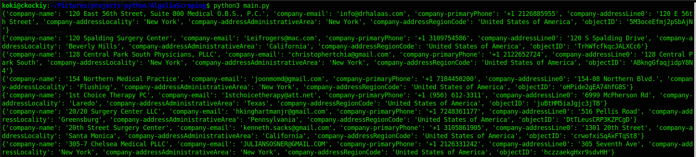

# Quada Tradewing API Interaction

This Python script interacts with the Quada Tradewing website and the Algolia API to retrieve information about organizations and companies.

## Description

The `Quada` class contains methods to perform the following tasks:

1. Obtain an API key from the Quada Tradewing website.
2. Retrieve a list of companies from the Algolia API.

## Installation

1. Clone the repository or download the source code.
2. Install the required dependencies by running `pip install requests`.

## Usage

1. Import the `Quada` class in your Python script.
2. Create an instance of the `Quada` class.
3. Call the `get_apikey()` method to obtain an API key from the Quada Tradewing website.
4. If the API key was obtained successfully, call the `get_companies(page_number)` method with the desired page number to retrieve a list of companies.

Example:

```python
from quada import Quada

quada = Quada()
apikey = quada.get_apikey()

if apikey:
   page_number = 0
   quada.get_companies(page_number=page_number)
```

